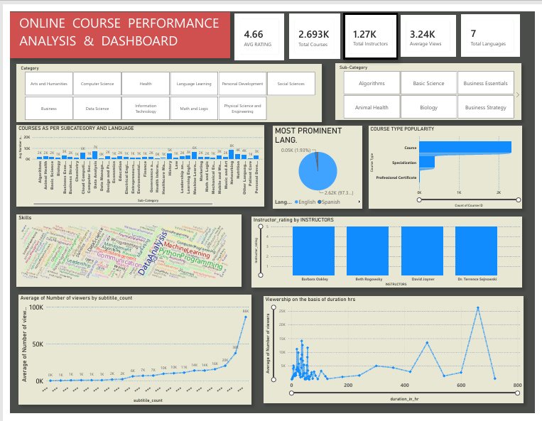

# 📊 Online Course Performance Analysis Dashboard

## 📌 Project Overview

This project was developed to help an EdTech startup analyze its recorded lecture data and uncover actionable business insights. The company has collected data from multiple online learning platforms but lacks visibility into learner preferences, course performance, instructor effectiveness, and content strategy.

Using Power BI, I designed an interactive dashboard that enables stakeholders to explore key metrics and make informed decisions regarding course offerings, instructor selection, language preferences, and viewer engagement.

---

# 🏢 Business Problem

The EdTech company aims to expand its library of recorded courses while maximizing learner engagement and business growth. However, the existing data is spread across multiple platforms and does not provide clear answers to important business questions.

The organization needs a centralized dashboard that enables decision-makers to:

- Identify the most popular course categories and sub-categories.
- Understand which course types perform best.
- Analyze viewer engagement across categories, languages, and instructors.
- Determine how course duration and subtitles influence viewership.
- Identify high-performing instructors for future collaborations.
- Understand the skills currently in demand across different domains.
- Optimize content strategy based on learner preferences.

This dashboard addresses these challenges by transforming raw data into interactive visual insights.

---

# 🎯 Project Objectives

The dashboard answers the following business questions:

### 1. Course Distribution Analysis
- Analyze the distribution of Course, Specialization, and Professional Certificate programs.
- Compare course offerings across categories and sub-categories.

### 2. Viewer Engagement Analysis
- Calculate average number of views across:
  - Categories
  - Sub-Categories
  - Languages

### 3. Skill Demand Analysis
- Identify the most frequently taught skills within each category.
- Highlight emerging and popular technologies.

### 4. Language Distribution
- Analyze courses based on language availability.
- Identify the dominant language used across the platform.

### 5. Language Preference by Category
- Determine which languages receive the highest viewer engagement.
- Focus on the top five categories for strategic content expansion.

### 6. Subtitle Impact Analysis
- Examine whether subtitle availability influences viewer engagement.

### 7. Instructor Performance
- Identify the Top 3 instructors (based on ratings) within each category and sub-category.

### 8. Course Duration Analysis
- Investigate the relationship between course duration and average views.
- Understand whether longer courses attract higher engagement.

### 9. Skills vs Viewership
- Analyze whether offering a diverse set of skills contributes to higher course popularity.

---

# 🛠️ Tools & Technologies

- Power BI
- Power Query (M Language)
- DAX
- Data Modeling
- Data Cleaning
- Data Visualization

---

# 📈 Dashboard Features

### KPI Cards
- ⭐ Average Rating
- 📚 Total Courses
- 👨‍🏫 Total Instructors
- 👀 Average Views
- 🌍 Total Languages

### Interactive Filters
- Category
- Sub-Category

### Visualizations
- Course Type Popularity
- Average Views by Category & Sub-Category
- Language Distribution
- Instructor Ratings
- Skills Word Cloud
- Subtitle vs Viewership
- Course Duration vs Views

---

# 🧹 Data Preparation

Before building the dashboard, the dataset was cleaned and transformed using Power Query.

Key preprocessing steps included:

- Handling missing values
- Removing duplicate records
- Data type conversions
- Creating calculated columns
- Creating DAX measures
- Building relationships
- Data formatting

---

# 📊 Key Insights

- Computer Science courses attract the highest viewer engagement.
- English is the dominant language across the platform.
- Viewer engagement varies significantly across course durations.
- Certain instructors consistently receive higher ratings.
- Course popularity differs considerably across categories.
- Skill diversity plays an important role in attracting learners.

---

# 📷 Dashboard Preview




---

# 📂 Repository Structure

```
Online-Course-Performance-Dashboard
│
├── Online_Course_Performance_Dashboard.pbix
├── Online_Courses.csv
├── dashboard.png
└── README.md
```

---

# 🚀 Future Improvements

- Add forecasting for future viewership trends.
- Build instructor recommendation models.
- Integrate real-time data refresh.
- Add sentiment analysis using course reviews.
- Deploy dashboard using Power BI Service.

---

# 👨‍💻 Author

**Vivek**

Delhi Technological University (DTU)

Aspiring Data Analyst | SQL | Power BI | Python | Excel
